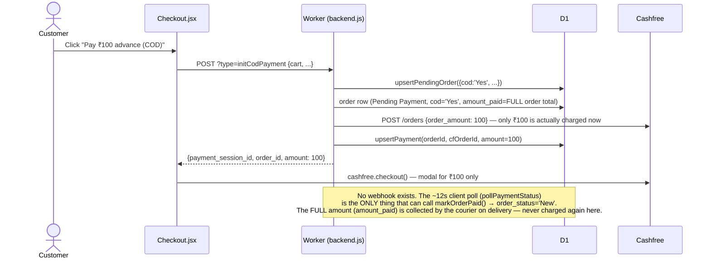

# Payment Flow — Root Cause Analysis

**Reported symptom (production):** orders sometimes stay `Pending Payment` even
though the customer completed payment successfully, and the same
customer/cart sometimes ends up with two order rows — one stuck
`Pending Payment`, one `New` — after the customer left the payment page once
and paid successfully on a later attempt. For COD, an order has been seen
reaching a placed state without the ₹100 advance actually clearing.

**Update (2026-07-15) — root cause found and fixed on non-prod, pending
prod:** what was first reported (2026-07-14) as "no Cashfree webhook is
configured" turned out to be more specific: a webhook *was* configured in
prod, but every single delivery attempt for at least 7 days had been
rejected with `HTTP 403` by this Worker's own CORS check — confirmed
directly against real Cashfree dashboard delivery logs, including a genuine
₹549 successful payment that was silently dropped. §2.1 below has the full
mechanism and the fix; §2.3 covers a second bug (payment-row deletion on
retry) that was dormant while the webhook was blocked but would have
activated the moment the CORS issue was fixed, so both were fixed together.

This document explains the current process end-to-end (button click →
API → Cashfree → DB), then walks through exactly where it breaks.

---

## 1. Current process, explained

There are two payment paths, both built the same way: **create a
`Pending Payment` order row first, then take payment, then promote the row
to `New` once payment is actually confirmed.** This order is intentional —
Cashfree needs a `cf_order_id`/amount to create its own order before the
customer ever sees a payment form, so *something* has to exist in D1 first.

- **Full online payment** — `initPayment` → `handlePayNow` (`Checkout.jsx`)
- **COD (₹100 advance)** — `initCodPayment` → `handleCodAdvancePayment` (`Checkout.jsx`)

Both are structurally identical (same helpers, same guard rails), differing
only in the amount charged (full total vs. fixed ₹100) and the `cod` flag
stored on the order. The code was written assuming a webhook would confirm
payment server-side, with the frontend poll as a UX nicety for immediate
feedback. That assumption doesn't hold today — see §2.1.

### 1.1 Sequence diagram — happy path (full online payment), as it actually runs today

```mermaid
sequenceDiagram
    actor C as Customer
    participant FE as Checkout.jsx
    participant BE as Worker (backend.js)
    participant D1 as D1 (orders / payments)
    participant CF as Cashfree

    C->>FE: Click "Pay Now"
    FE->>BE: POST ?type=initPayment {cart, name, address, ...}
    activate BE
    BE->>D1: upsertPendingOrder()<br/>SELECT ... WHERE customer_sub=? AND order_status='Pending Payment'<br/>AND product_list=? (exact string match)
    alt matching pending row exists
        D1-->>BE: existing.id
        BE->>D1: UPDATE orders SET ... WHERE id = existing.id
    else no match
        BE->>D1: INSERT INTO orders (..., order_status='Pending Payment')
    end
    D1-->>BE: orderId
    BE->>CF: POST /orders {order_amount, notify_url: WORKER_URL+?type=paymentWebhook}
    Note over BE,CF: notify_url is sent on every request, but no webhook<br/>is actually configured for this Cashfree account —<br/>Cashfree never calls it. This entire step is currently inert.
    CF-->>BE: {payment_session_id}
    BE->>D1: upsertPayment(orderId, cfOrderId, amount)<br/>DELETE FROM payments WHERE order_id=?<br/>INSERT INTO payments (order_id, cf_order_id, amount, status='PENDING')
    BE-->>FE: {payment_session_id, order_id}
    deactivate BE

    FE->>CF: cashfree.checkout({payment_session_id}) — opens MODAL (same tab)
    C->>CF: Enters card/UPI, completes payment
    CF-->>FE: checkout() resolves (SDK always resolves null — not trustworthy)

    rect rgb(255, 245, 235)
    Note over FE,CF: THE ONLY CONFIRMATION PATH THAT EXISTS TODAY.<br/>No webhook will ever call the backend independently.
    FE->>BE: POST ?type=paymentStatus {orderId} (×up to 6, 2s apart — ~12s total)
    BE->>D1: SELECT status FROM payments WHERE order_id=?
    Note over D1: status is still 'PENDING' — nothing else ever writes 'SUCCESS' to this row
    BE->>CF: GET /orders/{cf_order_id}
    CF-->>BE: order_status=PAID
    BE->>D1: UPDATE payments SET status='SUCCESS'; markOrderPaid(orderId) → order_status='New'
    BE-->>FE: {status: 'SUCCESS'}
    end

    FE->>FE: clearCart(); navigate('/orders')
```

**If the browser tab is closed, the app is backgrounded, or the customer is
bounced to a separate UPI app and doesn't return within that ~12-second
window, the `rect`-highlighted block above never runs — for anyone.** There
is nothing else in the system that will ever confirm that payment. Even if
Cashfree successfully charged the customer, D1 never finds out.

### 1.2 Sequence diagram — COD ₹100 advance

Identical shape, only the amount and the `cod` flag differ — same single
point of failure applies:



`order_status` only ever becomes `'New'` (i.e. "placed") through
`markOrderPaid()`, which today is only ever reachable via that one client
poll. There is no code path where a COD order reaches `'New'` from client
action alone without Cashfree having confirmed the ₹100 — but there's also
no path to reach `'New'` at all if the poll doesn't get to run (see §2.4 for
the one way this can still be bypassed manually).

---

## 2. Where it actually breaks

### 2.1 — ROOT CAUSE, FIXED (non-prod 2026-07-15, prod pending): the webhook existed but was rejected with 403 by our own CORS check

*(Written 2026-07-14, before the actual cause was pinned down — kept as-is
below since it correctly diagnoses the effect, just not yet the precise
mechanism. See the update at the top of this document and the fix note at
the end of this section for what was actually wrong.)*

`backend.js` has a fully-implemented `paymentWebhook` handler — signature
verification, idempotent lookup by `cf_order_id`, calls `markOrderPaid`.
Every `initPayment`/`initCodPayment` call correctly sends a `notify_url`
pointing at it. **None of that ran**, because — as first written here —
it looked like no webhook was configured at all. The code was written
assuming the webhook (server-to-server, independent of the customer's
device) would be the primary confirmation path, with the frontend poll as
a fast-feedback nicety. In reality, the poll was carrying 100% of the load
it was never designed to carry alone.

This directly explains "payment succeeded but shows Pending Payment,"
without needing any other bug in the mix: Cashfree took the money, the
customer's browser tab/app just wasn't still executing JS 12 seconds later
to ask about it — closed the tab too fast, switched to a UPI app and didn't
return promptly, lost signal, or the OS suspended a backgrounded mobile
browser tab. None of those are exotic; they're normal mobile payment
behavior, especially for UPI intent flows where the customer necessarily
leaves the browser to authorize in a separate app.

**This is not a "sometimes" bug — it is structurally guaranteed to happen at
some rate proportional to how often customers don't sit and watch the tab
for 12 seconds after paying**, and there is currently no way for any of
those orders to ever self-correct.

**What was actually wrong (confirmed 2026-07-15):** the webhook *was*
configured in Cashfree's dashboard for prod. Every delivery attempt was
failing with `HTTP 403 FORBIDDEN` — confirmed directly against Cashfree's
own webhook delivery logs, including a real successful ₹549 UPI payment
that never got confirmed. The cause: `fetch()`'s CORS block in `backend.js`
rejects any request whose `Origin` header doesn't match `ALLOWED_ORIGIN`,
with no exception for anything else — and Cashfree's webhook is a
server-to-server POST that never sends a browser `Origin` header at all, so
it could never pass that check. CORS is a browser-only enforcement
mechanism; it doesn't apply to server-to-server calls, and this route's
real authentication is the HMAC signature already verified inside
`paymentWebhook()`. **Fix:** the webhook route is now exempted from the
Origin check. Deployed and verified on non-prod (confirmed a simulated
no-`Origin` POST now returns `200` instead of `403`); pending the combined
prod push — see `CLAUDE.md`.

### 2.2 — Duplicate order rows: the reuse guard only catches a byte-for-byte identical retry

`upsertPendingOrder` (`backend.js`) de-dupes retries by:

```sql
SELECT id FROM orders
WHERE customer_sub = ? AND order_status = 'Pending Payment'
  AND custom_order_id IS NULL AND product_list = ?
```

`product_list` is built as `"{name} (Size: {size}, Qty: {qty})"` lines
joined per cart item. This was added specifically to fix an earlier version
of this same bug (see commit `9106f77`/`fc050f8` — a prior attempt hid
abandoned orders client-side, then was reverted in favor of this
reuse-on-exact-match approach, on the belief it fully solved the problem).

It only matches if the retried cart is **identical in content and order** to
the abandoned one. In practice, a customer who abandons a payment (or, per
§2.1, whose order is simply never confirmed despite paying) very commonly
adjusts something before retrying — changes a quantity, removes an item,
picks a different size, applies a coupon — all ordinary shopping behavior.
Any of that changes the `product_list` string, the lookup finds nothing, and
a **new** `Pending Payment` row is created next to the orphaned one from
before. Neither row is ever cleaned up. This is the direct mechanism behind
seeing two rows (one stuck `Pending Payment`, one `New`) for what was, from
the customer's perspective, one purchase.

### 2.3 — FIXED (non-prod, 2026-07-15): retries used to delete the previous payment record

`upsertPayment` (`backend.js`) used to hard-delete the order's previous
`payments` row before inserting a new one:

```js
const upsertPayment = async (orderId, cfOrderId, amount, googleSub) => {
    await env.DB.prepare("DELETE FROM payments WHERE order_id = ?").bind(orderId).run();
    await env.DB.prepare(
        "INSERT INTO payments (order_id, cf_order_id, amount, customer_sub) VALUES (?, ?, ?, ?)"
    ).bind(orderId, cfOrderId, amount, googleSub).run();
};
```

This didn't cause visible damage before §2.1 was fixed, only because there
was no webhook to orphan. Once the webhook actually reaches the backend,
this becomes live and dangerous: if a customer retries before an *earlier*
attempt's webhook has arrived, that retry's `upsertPayment` call deletes the
payment row the earlier webhook needs to match against (`SELECT ... WHERE
cf_order_id = ?` in `paymentWebhook` finds nothing → discarded as "unknown
order"). A real, successful charge from the first attempt would then have
no order to attach to — and if both attempts settle, the customer is
charged twice with only the second ever reflected.

**Fix (deployed and verified on non-prod, pending the combined prod push —
see `CLAUDE.md`):** `payments` gained an `is_deleted` column
(`schema_payments_soft_delete.sql`). `upsertPayment` now marks the prior
row(s) for an order as superseded (`is_deleted = 1`) instead of deleting
them, so a late-arriving webhook for an old `cf_order_id` still finds its
row and can call `markOrderPaid`. `getPaymentStatus` was updated to only
read the *current* (`is_deleted = 0`) attempt when polling, and — as an
extra safety net — now also checks the order's own `order_status` directly:
if an earlier attempt's webhook already confirmed (or failed) the order
while the customer's current attempt is still pending, the poll reports the
order's true state rather than the current attempt's own (possibly
still-pending) status.

**Follow-up (2026-07-15):** soft-deleting on every retry means a customer
who repeatedly opens checkout and backs out without paying accumulates one
`payments` row per attempt — harmless to correctness, but unbounded growth.
`upsertPayment` now only preserves (soft-deletes) the previous attempt while
it's recent enough (< 10 minutes old) that its webhook could plausibly still
be in flight; past that window it reuses the same row in place instead of
inserting a new one. 10 minutes is a generous margin — Cashfree's webhook
delivery is near-real-time, and this Worker's webhook handler always acks
with `200` (see `paymentWebhook`'s comment), so Cashfree never retries a
delivery it already made — the only lag being protected against is the
normal one-time delivery latency of the *first* attempt.

**Second follow-up, same day — active verification instead of a timer:**
`initPayment`/`initCodPayment` now call a new `resolvePriorPendingPayment()`
at the start of every retry, *before* creating a new Cashfree order. It
queries Cashfree directly for the prior attempt's real status:
- `PAID` → the "abandoned" attempt actually succeeded — `markOrderPaid()` is
  called immediately and the endpoint returns `{ alreadyPaid: true }`
  instead of a new `payment_session_id`. `Checkout.jsx` recognizes this and
  skips opening a second payment modal entirely, going straight to the
  orders page — no redundant charge is ever started.
- `ACTIVE` / `EXPIRED` / `CANCELLED` → Cashfree confirms nothing will ever
  come of that attempt (no webhook is coming) — the row is hard-deleted
  outright, keeping exactly one `payments` row per order in the common case.
- Cashfree unreachable → no-op; the 10-minute soft-delete/reuse logic above
  is the fallback, so nothing is ever deleted on a guess.

This replaces the timer as the *primary* mechanism (ground truth over a
heuristic) while keeping the timer as a safety net for when Cashfree itself
can't be reached.

Also fixed in the same change: the webhook only ever recognized
`payment_status` values of `"SUCCESS"` or `"FAILED"` — Cashfree's
`PAYMENT_USER_DROPPED_WEBHOOK` event (fired when a customer abandons the
modal) actually sends `"USER_DROPPED"`, which previously fell through to the
ambiguous `"PENDING"` bucket and never closed the order out. `USER_DROPPED`
is now treated the same as `FAILED`.

### 2.4 — Secondary: admin status changes have no payment-verification guard

`updateOrderStatus` / `applyOrderShippingUpdate` (`backend.js`) will accept
any status transition an admin submits — including moving a `Pending
Payment` COD order straight to `New`/`Shipped` — without checking whether
`payments.status = 'SUCCESS'` for that order at all. Given §2.1, this is
unlikely to be how most "COD placed without ₹100 collected" cases are
actually happening (the far more likely path is simply that the ₹100 *did*
clear on Cashfree, but the order was never confirmed and someone assumed it
was safe to advance manually) — but it's worth closing regardless: nothing
today distinguishes a genuinely-verified payment from an admin override.
**Not yet fixed.**

---

## 3. Recommendations (priority order)

1. ~~Get a real webhook configured with Cashfree, and fix §2.3 in the same
   change.~~ **Done (2026-07-15).** A webhook *was* already configured in
   prod — it was being rejected with a `403` by the CORS Origin allow-list
   before ever reaching the webhook logic (§2.1). Fixed and verified on
   non-prod, along with the `upsertPayment` soft-delete fix (§2.3) and
   `USER_DROPPED` handling in the same change. **Pending the combined prod
   deployment — see `CLAUDE.md`'s "Pending prod deployment" section.**
2. **Add a scheduled reconciliation job** (Cron Trigger in
   `wrangler.toml`) that finds `orders` in `Pending Payment` older than,
   say, 15 minutes with a linked `payments` row still `PENDING`, and
   re-queries Cashfree's order status directly — the same check
   `getPaymentStatus` already does, just run server-side on a timer instead
   of depending on the customer's tab. Do this even after the webhook is
   added — it's the safety net for whatever the webhook itself misses
   (delivery failures happen on every payment provider).
3. **Loosen or drop the exact-string cart match**, or replace it with
   something more deliberate — e.g. reuse *any* of the customer's
   `Pending Payment` orders regardless of cart contents (there should only
   ever be one legitimate in-flight checkout per customer at a time), or
   explicitly cancel/expire the old row when a new attempt starts instead of
   silently leaving it behind.
4. **Guard admin status transitions** on COD/online orders still in
   `Pending Payment` — require `payments.status = 'SUCCESS'` (or an explicit
   admin override reason) before allowing a move to `New` or beyond.
